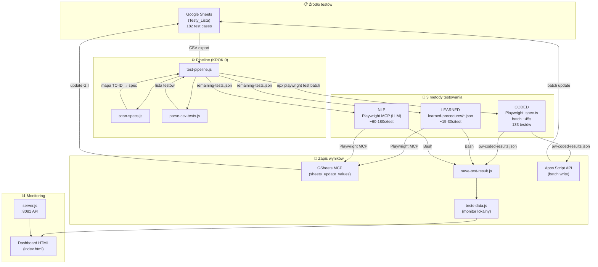
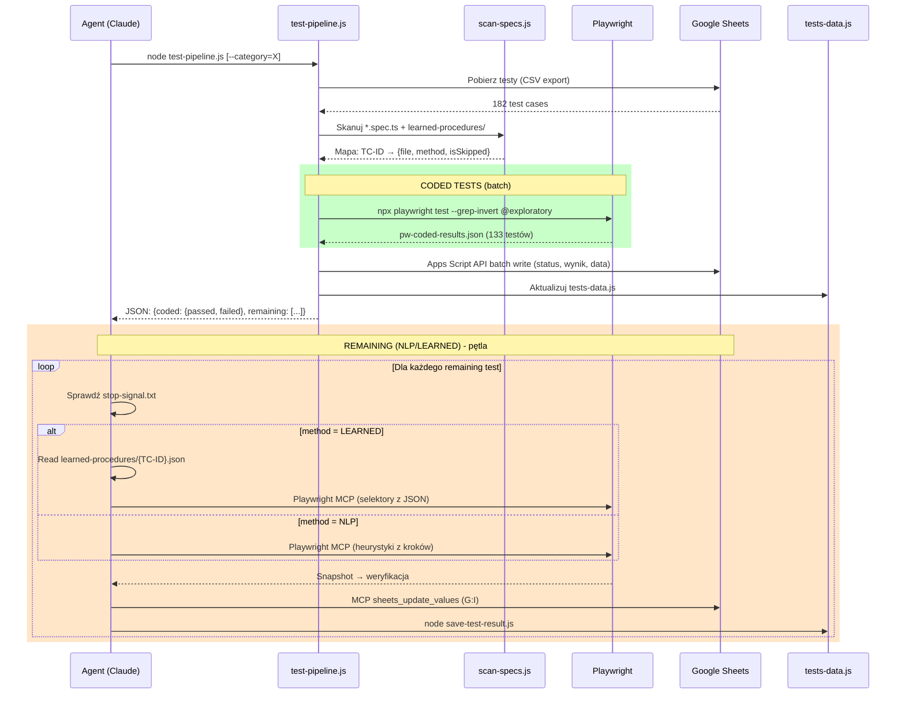
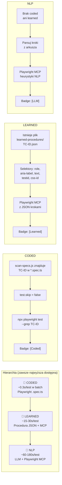
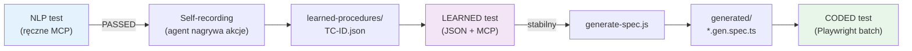
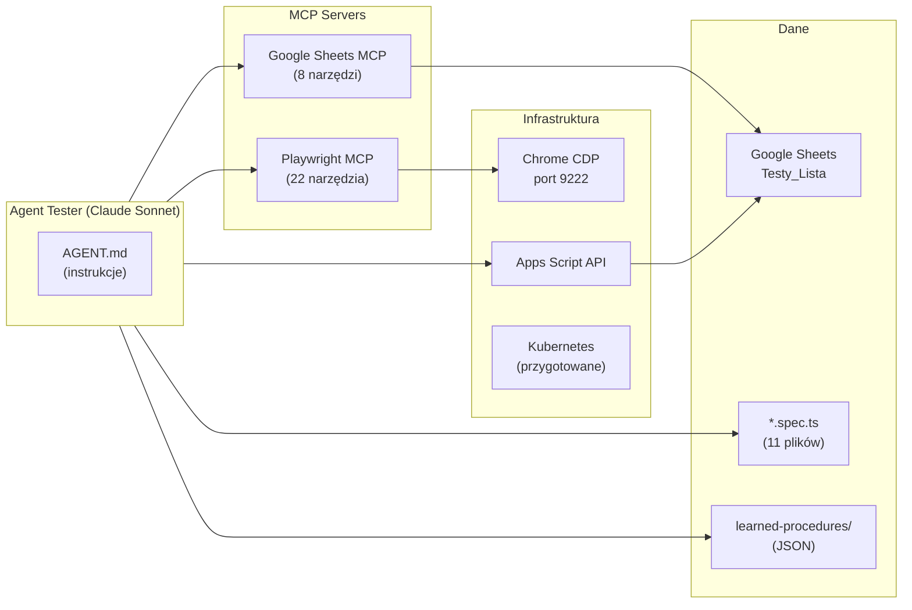

# Agent Tester - Architektura i schemat działania

Autonomiczny agent testowy dla **Universe MapMaker**. Pobiera testy z Google Sheets, wykonuje je przez Playwright, wyniki zapisuje z powrotem do arkusza i lokalnego dashboardu.

---

## Schemat ogólny



---

## Pipeline - szczegółowy przepływ



---

## 3 metody testowania - hierarchia



---

## Flywheel - samouczenie



> **Flywheel:** Test NLP → nagrany jako JSON → następnym razem LEARNED → wygenerowany jako .spec.ts → na zawsze CODED. Każdy test ewoluuje w kierunku szybszej metody.

---

## Struktura plików

```
~/.claude/agents/tester/           # Konfiguracja agenta (poza repo)
├── AGENT.md                       # Instrukcje agenta (SSOT)
├── memory.md                      # Pamięć agenta
├── config/
│   ├── sheet-config.json          # ID arkusza Google Sheets
│   ├── error-solutions.json       # Baza wiedzy o błędach
│   ├── known-bugs.json            # Znane bugi aplikacji
│   └── sheets-service-account.json
├── scripts/
│   ├── test-pipeline.js           # Batch pipeline (CODED + remaining)
│   ├── auto-tester.js             # NLP tester (heurystyki, bez LLM)
│   ├── run-tests.js               # Orkiestrator (pipeline + auto-tester)
│   ├── server.js                  # HTTP mikroserwis (:8081)
│   ├── scan-specs.js              # Skanuje specs → mapa TC-ID
│   ├── save-test-result.js        # Dual write: tests-data.js + GSheets
│   ├── session-manager.js         # Zarządzanie sesją testową
│   └── stop-monitor.js            # Hook: zatrzymaj monitor
├── monitor/
│   ├── index.html                 # Dashboard HTML (real-time)
│   ├── tests-data.js              # Dane dla dashboardu
│   └── stop-signal.txt            # Sygnał stopu
├── data/
│   ├── tests-queue.json           # Kolejka testów
│   ├── remaining-tests.json       # Testy dla LLM (po pipeline)
│   └── session-state.json         # Stan sesji
├── Dockerfile                     # Kontener (Playwright + tester)
└── k8s/                           # Kubernetes manifesty

MUIFrontend/e2e/                   # Pliki testowe (w repo)
├── *.spec.ts                      # 11 plików z coded testami
├── playwright.config.ts           # Konfiguracja Playwright
├── fixtures.ts                    # Fixture'y testowe
├── global-setup.ts                # Global setup (auth)
├── helpers/
│   ├── auth.ts                    # Login/logout helper
│   └── sheets-reporter.ts        # Reporter: wyniki → GSheets
├── learned-procedures/            # Nauczone procedury JSON
│   ├── TC-LOGIN-001.json
│   └── TC-TABLE-006.json
├── generated/                     # Auto-generated specs
│   └── *.gen.spec.ts
└── scripts/
    └── generate-spec.js           # JSON → .gen.spec.ts
```

---

## Integracje



---

## Mikroserwis (server.js)

Standalone HTTP serwer do uruchamiania testów zdalnie lub z dashboardu.

| Endpoint | Metoda | Opis |
|----------|--------|------|
| `/api/start` | POST | `{ category?, testId? }` - uruchom testy |
| `/api/stop` | POST | Zatrzymaj testy |
| `/api/status` | GET | `{ running, finished, summary }` |
| `/api/results` | GET | `{ summary, tests[] }` - pełne wyniki |
| `/api/reset` | POST | Reset sesji |
| `/` | GET | Dashboard HTML (monitor) |

- **Auth:** `X-API-Key` header
- **Port:** 8081 (domyślny)
- **Deploy:** Docker + K8s (`tests.universemapmaker.online`)

---

## Arkusz Google Sheets

**Spreadsheet:** `Testy_Lista` (ID: `1wFlv0KrT4JNTXAnGO4mwtDXPkh2dIxQzfM0VCXxA1jA`)

| Kolumna | Zawartość | Zapis |
|---------|-----------|-------|
| A: ID | `TC-LOGIN-001` | - |
| B: Kategoria | `LOGOWANIE` | - |
| C: Nazwa | Opis testu | - |
| D: Kroki | Numerowane kroki | - |
| E: Wymogi | Wymagania wstępne | - |
| F: Oczekiwany rezultat | Co powinno się wydarzyć | - |
| **G: Status** | `PASSED / FAILED / BLOCKED` | **Agent zapisuje** |
| **H: Wynik** | `[Coded/LLM/Learned] opis` | **Agent zapisuje** |
| **I: Data** | `YYYY-MM-DD HH:MM` | **Agent zapisuje** |

---

## Statystyki

| Metryka | Wartość |
|---------|---------|
| Testów w arkuszu | 182 |
| Coded (aktywnych) | 133 (73%) |
| Learned procedures | 2 |
| NLP (remaining) | 47 |
| Kategorii | 12 |
| Plików .spec.ts | 11 |

---

## Jak uruchomić

### Lokalnie (Claude Code)

```bash
# 1. Uruchom Chrome z remote debugging
chrome --remote-debugging-port=9222 --user-data-dir=%TEMP%\chrome-dev

# 2. Uruchom agenta testera
# (automatycznie: pipeline → coded batch → NLP pętla)
```

### Standalone (bez Claude)

```bash
# Tylko coded testy (batch)
cd ~/.claude/agents/tester
node scripts/test-pipeline.js --coded-only

# Pełny pipeline + NLP
node scripts/run-tests.js

# Mikroserwis z dashboardem
node scripts/server.js
# Otwórz http://localhost:8081
```

### Docker / Kubernetes

```bash
# Build i deploy
cd ~/.claude/agents/tester
docker build -t tester-agent .
# lub: bash k8s/deploy.sh
```

---

## Kategorie testów i aliasy

| Alias | Pełna nazwa | Prefix TC-ID |
|-------|-------------|---------------|
| LOGIN | LOGOWANIE | TC-LOGIN-* |
| PROJ | PROJEKTY | TC-PROJ-* |
| IMPORT | IMPORT WARSTW | TC-IMP-* |
| LAYER | ZARZĄDZANIE WARSTWAMI | TC-LAYER-* |
| TABLE | TABELA ATRYBUTÓW | TC-TABLE-* |
| NAV | NAWIGACJA MAPĄ | TC-NAV-* |
| PROPS | WŁAŚCIWOŚCI | TC-PROP-* |
| TOOLS | NARZĘDZIA | TC-TOOL-* |
| PUB | PUBLIKOWANIE | TC-PUB-* |
| UI | INTERFEJS | TC-UI-* |
| PERF | WYDAJNOŚĆ | TC-PERF-* |
| BUG | BŁĘDY | TC-BUG-* |
